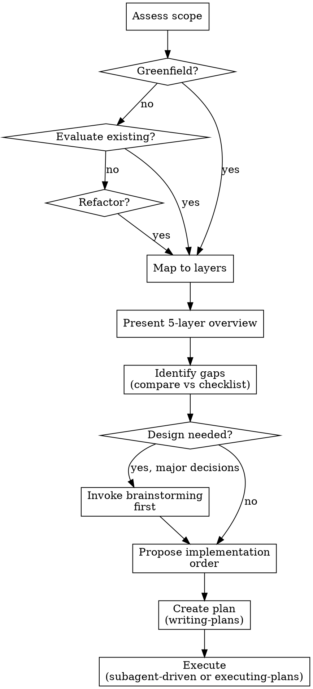

# Harness Engineering

## Overview

A complete engineering methodology for building production-grade Agent systems — derived from battle-tested claude-code architecture and organized as a 5-layer framework.

**This is methodology, not code.** The goal is a complete engineering blueprint that teams can follow to design, implement, and evaluate their own Agent harnesses.

<HARD-GATE>
Do NOT invoke any implementation skill, write any code, scaffold any project, or take any implementation action until you have understood the architecture scope and presented an adoption/implementation plan to the user.
</HARD-GATE>

## When to Use

Trigger this skill when:
- Starting a new Agent system project from scratch
- Evaluating an existing Agent framework against proven patterns
- Refactoring a messy or overgrown agent implementation
- Onboarding to a new Agent system codebase and needing the full architectural picture

## Prerequisites

This skill depends on the **superpowers** plugin for execution workflows. Installation varies by platform:

### Claude Code (Official Marketplace)
```bash
/plugin install superpowers@claude-plugins-official
```

### Claude Code (via Community Marketplace)
```bash
/plugin marketplace add obra/superpowers-marketplace
/plugin install superpowers@superpowers-marketplace
```

### Cursor
```
/add-plugin superpowers
```
Or search for "superpowers" in the plugin marketplace.

### GitHub Copilot CLI
```bash
copilot plugin marketplace add obra/superpowers-marketplace
copilot plugin install superpowers@superpowers-marketplace
```

### Gemini CLI
```bash
gemini extensions install https://github.com/obra/superpowers
```

### Codex / OpenCode
Tell your agent to fetch from:
```
https://raw.githubusercontent.com/obra/superpowers/refs/heads/main/.codex/INSTALL.md
```

**Verify installation:** Start a new session and ask "help me plan this feature" — the agent should automatically invoke `superpowers:brainstorming`.


## Anti-Pattern: "Just Start Coding"

A harness is foundational infrastructure — building without understanding the 5-layer architecture leads to:
- Security gaps (missing permission boundaries)
- Context overflow (no session compaction)
- Infinite loops (no explicit termination)
- Permission escalation (child inherits parent's full access)
- Hook-breaking failures (exceptions not isolated)

**Take time to assess before implementing.** The architecture will save you months of debugging.

## Checklist

You MUST complete these items in order:

1. **Assess scope** — Is this a greenfield harness, evaluating existing framework, or refactoring? What layers are in scope?
2. **Map to layers** — Which of the 5 layers does this project need? (Layer 0 is always needed)
3. **Present architecture overview** — Show the 5-layer table, explain each layer's responsibility
4. **Identify gaps** — Compare against `references/implementation-checklist.md` — what does the existing system lack?
5. **Propose layer-by-layer implementation order** — Layer 1 first (core), then Layer 2 (tools), etc.
6. **Evaluate if design is needed** — If significant architectural decisions needed, use `superpowers:brainstorming` first
7. **Create implementation plan** — Use `superpowers:writing-plans` to break work into tasks
8. **Transition to execution** — Use `superpowers:subagent-driven-development` or `superpowers:executing-plans`

## Process Flow



## The 5-Layer Architecture

| Layer | Component | Key Responsibility | Always Needed |
|-------|-----------|-------------------|--------------|
| **Layer 0** | System Prompt | Tool usage patterns, task workflow, fork/subagent, context compaction, security, hooks | **Yes** |
| **Layer 1** | Harness Core | Agent loop, session management, config & permissions | **Yes** |
| **Layer 2** | Tool System | Tool registry, executor, permission model, execution context | **Yes** |
| **Layer 3** | Plugin & Hooks | PreToolUse, PostToolUse, plugin lifecycle | Often |
| **Layer 4** | Multi-Agent | Sub-agent spawn, state handoff, collaboration patterns | Sometimes |

**Start with Layer 1 if building from scratch.** Jump to any specific layer if evaluating or improving a subsystem.

## Key Principles

1. **Layer 1 is foundation** — Don't add Layer 2 tools without Layer 1 session management and permission model
2. **Security at every layer** — Permission boundaries at Layer 1, input validation at Layer 2, hook isolation at Layer 3
3. **Session compaction is non-negotiable** — Without it, context overflow will break production systems
4. **Layer 4 inherits carefully** — Sub-agents must have independent sessions and scoped permissions
5. **YAGNI for plugins** — Layer 3 and Layer 4 are optional — add them only when needed
6. **Hot-swap tools, not core** — Tool registry allows adding/removing tools without touching harness core

## Core Resources

### Layer Specifications (read in order for greenfield, jump as needed for evaluation)

- **Layer 0 (System Prompt):** `specs/layer0-system-prompt.md`
- **Layer 1 (Harness Core):** `specs/layer1-harness-core.md`
- **Layer 2 (Tool System):** `specs/layer2-tool-system.md`
- **Layer 3 (Plugin & Hooks):** `specs/layer3-plugin-hooks.md`
- **Layer 4 (Multi-Agent):** `specs/layer4-multi-agent.md`

### Reference Materials

- **System prompt patterns:** `references/system-prompts/` (40+ reference files)
- **claw-code mapping:** `references/claw-code-patterns.md`
- **Engineering checklist:** `references/implementation-checklist.md`
- **Common pitfalls:** `references/common-pitfalls.md`

## Layer 0 Quick Reference — System Prompt

- [ ] Tool descriptions include specific use cases and parameter descriptions
- [ ] Tool input_schema is complete with required/optional properties
- [ ] Permission model aligned with tool capability requirements
- [ ] Error responses return structured format (not raw exceptions)
- [ ] All bash commands have timeout consideration
- [ ] File modifications read existing content first
- [ ] Fork prompts are directives, not situation reports
- [ ] No peek/race on fork completion notifications
- [ ] Context compaction uses structured summary format
- [ ] Pre-tool-use checks prevent injection attacks
- [ ] Hooks cannot break tool execution chain

## Layer 1 Quick Reference — Harness Core

- [ ] Agent Loop has explicit termination (no infinite loops)
- [ ] Session history is serializable and resumable
- [ ] Session compaction prevents context overflow (`should_compact()`, `compact_session()`)
- [ ] Permission model covers all tools (5 modes: ReadOnly, WorkspaceWrite, DangerFullAccess, Prompt, Allow)
- [ ] LLM failures have exponential backoff retry
- [ ] Tool execution can be forcibly terminated
- [ ] Token usage is tracked (`UsageTracker`, `TokenUsage`)

## Layer 2 Quick Reference — Tool System

- [ ] All tools have complete input_schema
- [ ] Dangerous tools have timeout and resource limits
- [ ] Tool errors return standardized format to LLM
- [ ] Tools are hot-swappable (no core code changes)
- [ ] File operations (read/write/edit/glob/grep) have permission boundaries
- [ ] Bash execution has shell timeout and resource limits

## Layer 3 Quick Reference — Plugin & Hooks

- [ ] Hook errors cannot break tool execution
- [ ] Hooks are configurable on/off
- [ ] Plugin version constraints prevent conflicts
- [ ] Hook logs are traceable
- [ ] MCP servers can be integrated via stdio or WebSocket

## Layer 4 Quick Reference — Multi-Agent

- [ ] Sub-agents have independent Session IDs
- [ ] Parent-child communication has explicit protocol
- [ ] Sub-agents have independent timeouts
- [ ] Parallel agents have resource quotas
- [ ] MCP tools are discoverable from parent to child agents
- [ ] Session can be forked with permission inheritance

## Common Mistakes by Layer

**Layer 0:**
- Vague tool descriptions → LLM selects wrong tool
- Missing input_schema validation → crashes on bad input
- Fork peeking mid-flight → context pollution
- Fork racing results → fabricated output
- No context compaction → context window overflow
- Hook breaks execution chain → silent failures

**Layer 1:**
- No explicit loop termination → infinite loops
- Shared mutable session state → non-deterministic behavior
- Permission checks at tool level instead of harness level → gaps
- No session compaction → context window overflow
- Missing token usage tracking → unbounded cost growth

**Layer 2:**
- Vague tool descriptions → LLM selects wrong tool
- Missing input_schema validation → crashes on bad input
- No bash timeout → system freeze
- File operations bypass permission model → security gaps

**Layer 3:**
- Uncaught hook exceptions → break the execution chain
- Hook modifies input without LLM awareness → wrong assumptions propagate
- Undefined hook execution order → non-reproducible behavior
- MCP server misconfiguration → tools unavailable silently

**Layer 4:**
- Parent and child share Session → context exhaustion
- No sub-agent timeout → permanent blocking
- Too many parallel agents → resource contention
- Child inherits parent's full permission → privilege escalation risk

Full analysis: `references/common-pitfalls.md`


## After the Architecture

Once the architecture assessment is complete and the plan is created:

1. **Execute the plan** — Use `superpowers:subagent-driven-development` for task-by-task implementation with two-stage review
2. **Test per layer** — Use `agent-tdd` skill for layer-specific TDD strategies
3. **Need code review** — Use `superpowers:requesting-code-review`
4. **Debugging issues** — Use `superpowers:systematic-debugging`

## Integration with Other Skills

- **Testing your harness:** Use `agent-tdd` skill for layer-specific TDD strategies
- **Planning next:** Use `superpowers:writing-plans` to create implementation plan
- **Already building:** Use `superpowers:executing-plans` to execute with checkpoints
- **Need review:** Use `superpowers:requesting-code-review`
- **Debugging:** Use `superpowers:systematic-debugging`

## Visual Companion

A browser-based companion for showing architecture diagrams and layer interactions. Available as a tool — not a mode.

**Offering the companion:** When explaining multi-layer interactions or system design, offer once:
> "Some of this architecture may be easier to follow with a visual diagram. Want me to show you the layer interactions in a browser?"

**This offer MUST be its own message.** Do not combine with other content.

**Per-question decision:** Even after the user accepts, decide FOR EACH QUESTION whether to use the browser or the terminal:
- **Use the browser** for architecture diagrams, layer interaction maps, flowcharts
- **Use the terminal** for implementation details, code snippets, checklist reviews
